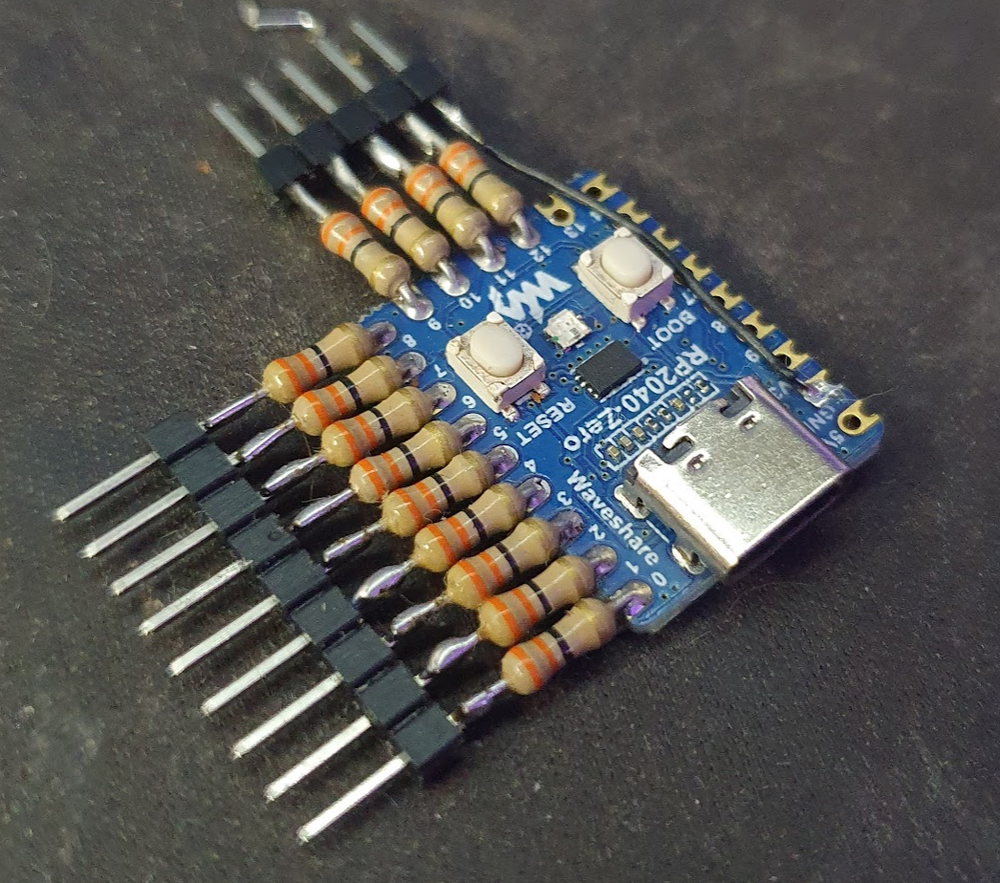

# JTAG

Sometimes when you have no idea what's the pinout of the JTAG port, you have to find a way to correctly identify each of the JTAG pins. There are few ways to do that, one of them is by "bruteforcing" the pins for `IDCODE` or `BYPASS` JTAG commands.

There are several tools and ways to enumerate JTAG pins. Here are few:

* Probing pin voltage, resistence to VCC and GND (TODO)
* Searching with Joe Grand's JTAGulator (TODO)
* [Using an Arduino Pro Micro](#jtagenum-with-arduino-or-raspberry-pi)
* [Using an Raspberry Pi Pico](#searching-jtag-pins-with-raspberry-pi-pico)

## Searching JTAG pins with Raspberry PI Pico

* Raspberry Pi Pico: [https://github.com/racerxdl/JTAGscan](https://github.com/racerxdl/JTAGscan) made by [szymonh](https://github.com/szymonh/) adapted to RP2040 by [racerxdl](https://github.com/racerxdl/JTAGscan)

### How does it work?

JTAGscan iterates over all defined pins (currently for RP2040, the first 16 pins) searching for TMS, TCK, TDO and TDI.

It has two approaches:

* Try reading `IDCODE` - Only requires TMS, TCK and TDO so it's faster. Unfortunately not all devices support `IDCODE` command (although most of them do). This doesn't find the TDI pin.
* Shifting bits in `BYPASS` mode. This can find all pins, but it is slower (since not only you have one more pin to iterate over, but also need to shift "enough" bits through the JTAG Chain).

### Hardware suggestions

Any raspberry pi pico board should work fine for scanning JTAG ports. Make sure you check the VCC of the target to see if it is 3.3V. Being other voltage level will require a level-shifter to avoid damage.

It is also recommended to use series 33 Ohm resistors in series with every tested pin to avoid short circuiting if some pin you're testing is an output.



### Programming the PiPico

1. Go to `Releases` and download the `jtagscan-xxxx.zip`
2. Extract the zip file for the `uf2` file
3. Plug your raspberry pi pico in the USB port while pressing the **BOOT** button (to enable bootloader)
4. A new "disk" should appear in your machine. Drag the `uf2` file to the disk
5. The raspberry pi pico should reboot and be recognized as a usb-serial converter

### Using

Open the detected serial port in your favorite serial terminal application (for example, [PuTTY](https://www.putty.org/))

Hit the key `h` to show the help.

```
+-------------------------------+
|  JTAGscan Jtag Pinout Finder  |
+-------------------------------+
 a - Automatically find all pins
 i - IDCODE search for pins
 b - BYPASS search for pins
 t - TDI-only BYPASS search
 m - set pin mask, current: 0xFFFF
 d - set debug level: 1
 c - half cycle us, current: 32
 h - print this help
+-------------------------------+
```

Hit `a` for scan the JTAG pins. This will do first a `IDCODE` scan and then a `BYPASS` scan. Depending on how many pins are in `pin mask` field (you can change it by using `m`) it should take a while. When successfully, the scanner will stop with a message like this one:

```
     Automatically searching
+-- Starting with IDCODE scan --+
| TCK | TMS | TDO |      IDCODE |
+-------------------------------+
|   2 |   3 |   0 |    cba00477 |
+----------- SUCCESS -----------+
    TCK, TMS, and TDO found.

+-- BYPASS searching, just TDI -+
| TCK | TMS | TDO | TDI | Width |
+-------------------------------+
|   2 |   3 |   0 |   1 |    31 |
+----------- SUCCESS -----------+
```


## JTAGEnum with Arduino or Raspberry Pi

JTAGenum is an open source Arduino JTAGenum.ino or RaspbberyPi JTAGenum.sh (experimental) scanner. This code was built with three primary goals:

* Given a large set of pins on a device determine which are JTAG lines
* Enumerate the Instruction Register to find undocumented functionality

⚠️ JTAG and device must share the same ground.

Software Connection Set up:

* Download the INO sketch from the github
* Open the Arduino IDE and Load the downloaded JTAGEnum sketch
* Choose the correct Serial Port and Board
* Compile and Upload the sketch
* Open the Serial Monitor
* Set the correct baud rate
* Enter the command to scan ("s")

Arduino PIN Layout

* Digital PIN 2(Black)
* Digital PIN 3(White)
* Digital PIN 4(Grey)
* Digital PIN 5(Maroon)
* Digital PIN 6(Blue)
* GND - GREEN


### References

* [JTAGulator vs. JTAGenum, Tools for Identifying JTAG Pins in IoT Devices by Dylan Ayrey](https://www.praetorian.com/blog/jtagulator-vs-jtagenum-tools-for-identifying-jtag-pins-in-iot-devices?edition=2019)
* [JTAG PIN Identification - February 21, 2017](https://just2secure.blogspot.com/2017/02/jtag-pin-identification.html)
* [Hardware Debugging for Reverse Engineers Part 2: JTAG, SSDs and Firmware Extraction - Posted Apr 2, 2020 by wrongbaud](https://wrongbaud.github.io/posts/jtag-hdd/)
