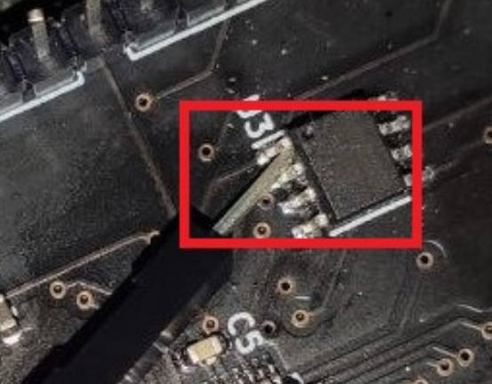

# Fault Injection

### AVR Glitch: Modifying Code Execution Paths Using Only Voltage

[https://flawed.net.nz/2017/01/29/avr-glitch-modifying-code-execution-paths-using-only-voltage/](https://flawed.net.nz/2017/01/29/avr-glitch-modifying-code-execution-paths-using-only-voltage/)

### Pin2pwn

[https://media.defcon.org/DEF%20CON%2024/DEF%20CON%2024%20presentations/DEF%20CON%2024%20-%20Brad-Dixon-Pin2Pwn-How-to-Root-An-Embedded-Linux-Box-With-A-Sewing-Needle-UPDATED.pdf](https://media.defcon.org/DEF%20CON%2024/DEF%20CON%2024%20presentations/DEF%20CON%2024%20-%20Brad-Dixon-Pin2Pwn-How-to-Root-An-Embedded-Linux-Box-With-A-Sewing-Needle-UPDATED.pdf)

In the case of an external SPI flash, it is possible for an attacker to short these pins :

The MCU will not be able to get data from the external flash and then show a stacktrace, get a shell in the bootloader or worst a root shell on the embedded Linux.

Here is a practical example, putting a cable between MOSI and Chip Select :

